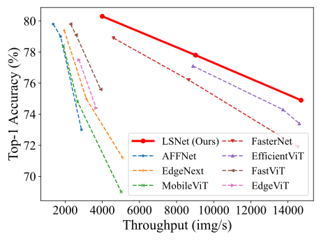

# LSNet 画师风格分类与聚类工作流

本仓库提供了一套面向画师风格理解的端到端流程，涵盖数据准备、模型训练、推理部署与聚类检索。以下内容帮助你确认代码是否满足需求，并在一个文档中掌握全流程使用方法。

## 功能概览

- **数据准备**：`prepare_dataset.py` 自动将原始画师文件夹划分为 ImageFolder 结构，并生成 `class_mapping.csv` 等元信息。
- **模型训练**：`train_artist_style.py` 支持多种 LSNet 画师模型，支持对比损失增强训练，训练结束自动导出类别映射 CSV 及模型权重。
- **推理部署**：`inference_artist.py` 在分类模式下依赖训练生成的 `class_mapping.csv` 进行标签映射，可选提取特征进行聚类或二者同时执行。
- **多标签任务**：`train_artist_multilabel.py` 支持基于多标签 CSV 的训练与评估，`predict_artist_multilabel.py` 提供批量推理与置信度/比重导出。
- **工具脚本**：`utils.py`、`losses.py`、`robust_utils.py` 等辅助训练；`flops.py`、`speed.py`、`eval.sh` 等用于性能测算与评测。


## 环境准备

### Python 依赖

```powershell
python -m venv .venv
.\.venv\Scripts\Activate.ps1
pip install --upgrade pip
pip install -r requirements.txt
```

`requirements.txt` 已涵盖 `torch`、`timm`、`torchvision` 等核心依赖。若使用 GPU，请确保本地 CUDA 与 PyTorch 版本匹配。

### 数据目录结构

原始数据需按照“画师 -> 多张作品”方式存放：

```
source_dir/
├── artist_A/
│   ├── img_001.jpg
│   ├── ...
├── artist_B/
│   ├── 0001.png
│   ├── ...
└── ...
```

## 步骤一：数据准备

使用 `prepare_dataset.py` 将原始数据划分为训练/验证集，并生成推理所需的 `class_mapping.csv`。

```powershell
python prepare_dataset.py ^
  --source-dir D:\datasets\raw_artists ^
  --output-dir D:\datasets\artist_dataset ^
  --val-ratio 0.2 ^
  --min-images 10
```

脚本执行后将得到：

```
artist_dataset/
├── train/
│   ├── artist_A/
│   └── ...
├── val/
│   ├── artist_A/
│   └── ...
├── class_mapping.csv       # class_id ↔ class_name
├── class_names.json
├── dataset_info.json
└── split_info.txt
```

> `class_mapping.csv` 会在训练与分类推理阶段重复使用，请妥善保留。

## 步骤二：模型训练

运行 `train_artist_style.py` 以训练 LSNet 画师模型。脚本会在输出目录中生成：

- `checkpoint.pth`：最新模型权重
- `model_best.pth`：性能最佳权重
- `class_mapping.csv`：训练时根据数据集自动导出的类别映射
- `train_log.txt` / TensorBoard 日志等

示例命令：

```powershell
python train_artist_style.py ^
  --model lsnet_t_artist ^
  --data-path D:\datasets\artist_dataset ^
  --output-dir D:\experiments\lsnet_t ^
  --batch-size 128 ^
  --epochs 300 ^
  --num_workers 8
```

常用参数说明：

- `--model`：可选 `lsnet_t_artist`、`lsnet_s_artist`、`lsnet_b_artist`、`lsnet_l_artist`，你可以在`model\lsnet_artist.py`里面自己改参数加预设
  - `lsnet_t_artist`: Tiny模型，参数量约11.4M，适合快速实验
  - `lsnet_s_artist`: Small模型，参数量约16.1M，平衡性能和效率
  - `lsnet_b_artist`: Base模型，参数量约23.2M，更好的性能
  - `lsnet_l_artist`: Large模型，参数量约50M+，适合大规模训练和更高精度需求
  - `lsnet_xl_artist`: Extra Large模型，参数量约100M+，专门用于处理100万+图片、10万+类别的大数据集
- `--eval-every`：每隔多少个epoch进行一次评估（默认：1，每epoch都评估）
- `--save-every`：每隔多少个epoch保存一次checkpoint（默认：None，仅保存最终和最佳checkpoint）
- `--finetune`：在验证阶段将图像等比缩放至训练分辨率，适用于迁移学习微调
- `--dist-eval`：在验证阶段启用分布式采样，便于多卡同步评估
- `--resume`：断点续训
- `--finetune-from`：仅加载指定 checkpoint 的模型权重（会忽略优化器等训练状态），常用于迁移学习；若分类数不一致会自动重置分类头
- `--teacher-model` / `--teacher-path`：配置蒸馏教师模型及权重
- `--contrastive-loss`：启用监督对比损失，提升特征表示质量
- `--contrastive-weight`：对比损失权重（默认0.1，0.0=禁用，1.0=与交叉熵等权重）
- `--contrastive-temperature`：对比损失温度参数（默认0.07，控制学习严格程度）
- `--use-vq`：在对比损失中启用向量量化（VQ-VAE风格）
- `--vq-num-embeddings`：VQ代码本大小（默认256）
- `--vq-commitment-cost`：VQ承诺损失权重（默认0.25）

训练结束后，`output-dir` 下的 `class_mapping.csv` 将作为后续分类推理的唯一标签映射文件。

### 对比损失增强训练

从 v1.1.0 开始，`train_artist_style.py` 支持**监督对比损失**，可以显著提升特征表示质量和分类性能。

#### 对比损失原理

对比损失通过以下方式改善模型：
- **正样本拉近**：同一画师的作品特征向量更相似
- **负样本推远**：不同画师的作品特征向量更远离
- **特征归一化**：使用余弦相似度计算距离
- **联合优化**：与交叉熵损失协同工作

#### 使用方法

```powershell
# 推荐配置：启用对比损失，默认权重
python train_artist_style.py ^
  --model lsnet_t_artist ^
  --data-path D:\datasets\artist_dataset ^
  --output-dir D:\experiments\lsnet_t_contrastive ^
  --batch-size 128 ^
  --epochs 300 ^
  --contrastive-loss

# 自定义权重配置
python train_artist_style.py ^
  --model lsnet_t_artist ^
  --data-path D:\datasets\artist_dataset ^
  --output-dir D:\experiments\lsnet_t_contrastive ^
  --batch-size 128 ^
  --epochs 300 ^
  --contrastive-loss ^
  --contrastive-weight 0.2 ^
  --contrastive-temperature 0.05
```

#### 参数说明

- `--contrastive-loss`：启用监督对比损失
- `--contrastive-weight`：对比损失权重
  - `0.0`：禁用对比损失（默认）
  - `0.1`：轻量辅助损失（推荐）
  - `1.0`：与交叉熵等权重
  - `>1.0`：更注重特征学习
- `--contrastive-temperature`：温度参数
  - `0.05-0.1`：较严格的学习
  - `0.1-0.2`：较平滑的学习

#### 效果预期

- **特征质量提升**：聚类和检索性能改善
- **分类准确率提升**：尤其在细粒度风格区分上
- **训练稳定性**：对比损失提供额外的正则化
- **推理兼容性**：不影响现有推理流程

#### 向量量化增强（VQ-VAE风格）

从 v1.2.0 开始，支持在对比损失中集成**向量量化（Vector Quantization）**，实现VQ-VAE风格的离散特征学习。

**VQ机制原理：**
- **代码本学习**：维护一个离散的向量集合（codebook）
- **量化映射**：将连续特征映射到最近的代码本向量
- **直通梯度**：使用直通梯度估计解决离散变量的梯度问题
- **联合优化**：同时优化重建损失、VQ损失和承诺损失

**使用方法：**

```powershell
# 启用VQ增强的对比学习
python train_artist_style.py ^
  --model lsnet_t_artist ^
  --data-path D:\datasets\artist_dataset ^
  --output-dir D:\experiments\lsnet_t_vq ^
  --batch-size 128 ^
  --epochs 300 ^
  --contrastive-loss ^
  --contrastive-weight 0.1 ^
  --use-vq ^
  --vq-num-embeddings 512 ^
  --vq-commitment-cost 0.1
```

**VQ参数说明：**
- `--use-vq`：启用向量量化
- `--vq-num-embeddings`：代码本大小（建议256-1024，根据类别数调整）
- `--vq-commitment-cost`：承诺损失权重（建议0.1-0.5）

**VQ增强效果：**
- **离散表示**：学习更紧凑的类别原型
- **聚类友好**：离散特征更适合聚类算法
- **存储高效**：可以用索引代替连续向量
- **泛化能力**：减少过拟合风险

### 多卡训练（分布式启动）

- `train_artist_style.py` 已集成 `torch.distributed`；`--batch-size` 指每张 GPU 的 batch，采样器会自动按世界大小拆分。
- 推荐使用 **torchrun**（PyTorch≥1.10）启动。它会为每个进程设置 `RANK / LOCAL_RANK / WORLD_SIZE`，脚本会进入分布式模式。
- 注意：PyTorch 的 NCCL 后端仅在 Linux/WSL 中支持 GPU 通信，原生 Windows 下若不使用 WSL 会报错；如必须在 Windows 原生环境实验，可把 `utils.init_distributed_mode` 中的 `args.dist_backend` 改为 `gloo`（仅 CPU 通信）。

单机两卡示例（在 WSL 或 Linux Shell 下执行）：

```bash
torchrun --standalone --nnodes=1 --nproc_per_node=2 train_artist_style.py \
  --model lsnet_t_artist \
  --data-path /mnt/d/datasets/artist_dataset \
  --output-dir /mnt/d/experiments/lsnet_t \
  --batch-size 128 \
  --epochs 400 \
  --num_workers 8 \
  --dist-eval
```

- 想限定可见 GPU，可在命令前加 `CUDA_VISIBLE_DEVICES=0,1`。
- 断点续训继续多卡时添加 `--resume outputs_artist/checkpoint.pth`，总 batch 变化时请按比例调节 `--lr`。
- 多机场景需要把 `torchrun` 换成带 `--nnodes`、`--node_rank`、`--master_addr`、`--master_port` 的多机参数，并保证各节点之间网络互通。

## 多标签风格混合任务(未测试过，不要用)

当一幅作品同时融合多位画师风格时，可以通过多标签训练/推理脚本获得更细粒度的置信度分析。

### 数据标注格式(未测试过，不要用)

新脚本使用 CSV 描述标签：

```csv
image_path,labels
mix_samples/img_001.jpg,"artist_A,artist_B"
mix_samples/img_002.jpg,"(re:zero:1.4),artist_C"
```

- `image_path` 相对于 `--data-path` 根目录或为绝对路径。
- `labels` 默认使用逗号分隔，可通过 `--label-delimiter` 自定义；带权重的条目写成 `(label:weight)`，例如 `(re:zero:1.4)` 代表 `re:zero` 占据 1.4 的混合比重（训练时会按比例归一化）。
- 训练集与验证集各自对应一份 CSV 文件，类别集合在训练集中自动汇总并复用到验证集。
- 若已有“图片 + 同名 .txt”结构，可使用：

  ```powershell
  python tools/generate_multilabel_csv.py ^
    --input-dir D:\datasets\artist_mix ^
    --output-csv annotations/all_multilabel.csv ^
    --recursive
  ```

  若希望一步生成训练/验证 CSV，并按标签出现次数过滤，可改用：

  ```powershell
  python tools/split_multilabel_dataset.py ^
    --input-dir D:\datasets\artist_mix ^
    --train-csv annotations/train_multilabel.csv ^
    --val-csv annotations/val_multilabel.csv ^
    --val-ratio 0.2 ^
    --min-label-count 5 ^
    --relative-paths ^
    --recursive
  ```

  该脚本会：

  - 按 `val-ratio` 随机划分 train / val；
  - 丢弃在全局出现少于 `min-label-count` 次的标签；
  - 输出符合训练脚本要求的逗号分隔 + 权重语法 CSV。

### 多标签训练与评估(未测试过，不要用)

```powershell
python train_artist_multilabel.py ^
  --data-path D:\datasets\artist_dataset ^
  --train-ann annotations/train_multilabel.csv ^
  --val-ann annotations/val_multilabel.csv ^
  --model lsnet_t_artist ^
  --output-dir D:\experiments\lsnet_t_multilabel ^
  --batch-size 96 ^
  --epochs 120 ^
  --num_workers 8 ^
  --threshold 0.4
```

脚本特点：

- 自动计算每个标签的正负样本权重，对应 `BCEWithLogitsLoss(pos_weight=…)`，缓解长尾分布。
- 训练、验证阶段统一输出 micro / macro mAP、F1、Precision/Recall 等多标签指标。
- 继续支持 `--finetune-from`、`--resume`、`--dist-eval` 等常用参数。
- 仍会在输出目录生成 `class_mapping.csv`（类别顺序）与 `label_stats.csv`（每个标签的样本数、全局占比与平均权重），便于复用与审计。

若仅想查看指标，可直接运行：

```powershell
python train_artist_multilabel.py ^
  --data-path D:\datasets\artist_dataset ^
  --train-ann annotations/train_multilabel.csv ^
  --val-ann annotations/val_multilabel.csv ^
  --model lsnet_t_artist ^
  --resume D:\experiments\lsnet_t_multilabel\best_checkpoint.pth ^
  --eval
```

### 多标签推理与置信度比重(未测试过，不要用)

```powershell
python predict_artist_multilabel.py ^
  --checkpoint D:\experiments\lsnet_t_multilabel\best_checkpoint.pth ^
  --class-mapping D:\experiments\lsnet_t_multilabel\class_mapping.csv ^
  --inputs D:\samples\hybrid ^
  --output D:\results\hybrid_confidence.json ^
  --top-k 6 ^
  --threshold 0.05 ^
  --normalize-ratio
```

- `--normalize-ratio` 会把每张图的 Sigmoid 置信度标准化为和为 1 的比重，方便评估风格占比；不启用时保留独立的置信度概率。
- `--debug-full` 可在输出 JSON 中附带所有类别的原始置信度矩阵。
- 如需递归扫描子目录，增加 `--recursive`。

> 📌 **置信度如何理解？** 多标签模型输出的是每个画师标签的 Sigmoid 概率，代表“这张图是否含有该风格”的置信度；若想近似理解为风格占比，可在前述推理脚本中开启 `--normalize-ratio` 对概率向量做归一化，获得相对比重参考。

## 步骤三：推理与特征提取

`inference_artist.py` 支持三种模式：

- `classify`：使用分类头输出前 Top-K 画师
- `cluster`：仅提取特征向量（无需 CSV）
- `both`：同时输出分类结果与特征

### 单张图像分类

```powershell
python inference_artist.py ^
  --mode classify ^
  --model lsnet_t_artist ^
  --checkpoint D:\experiments\lsnet_t\model_best.pth ^
  --class-csv D:\experiments\lsnet_t\class_mapping.csv ^
  --input D:\samples\test.jpg ^
  --output D:\results\single ^
  --class-csv artist_dataset\class_mapping.csv
```

**推理参数说明：**

- `--top-k`：显示的预测结果数量（默认：5）
- `--threshold`：概率阈值过滤，只显示概率≥此值的预测结果（默认：0.0，仅单图推理支持）

**示例：显示Top-3结果，过滤低置信度预测**

```powershell
python inference_artist.py ^
  --mode classify ^
  --model lsnet_t_artist ^
  --checkpoint D:\experiments\lsnet_t\model_best.pth ^
  --class-csv D:\experiments\lsnet_t\class_mapping.csv ^
  --input D:\samples\test.jpg ^
  --output D:\results\single ^
  --top-k 3 ^
  --threshold 0.2
```

输出位于 `output\test_result.json`，内含 Top-K 预测类别及概率。

### 批量分类 + 特征保存

```powershell
python inference_artist.py ^
  --mode both ^
  --model lsnet_t_artist ^
  --checkpoint D:\experiments\lsnet_t\model_best.pth ^
  --class-csv D:\experiments\lsnet_t\class_mapping.csv ^
  --input D:\samples\batch ^
  --output D:\results\batch ^
  --batch-size 64 ^
  --top-k 3
```

当输入为目录时：

- `batch_results.json`：逐图像的分类结果与特征向量（支持top-k参数）
- `features.npy`：堆叠后的特征矩阵，可用于聚类或相似检索
- `image_names.txt`：特征矩阵的文件名顺序

### 仅提取特征

```powershell
python inference_artist.py ^
  --mode cluster ^
  --model lsnet_t_artist ^
  --checkpoint D:\experiments\lsnet_t\model_best.pth ^
  --input D:\samples\batch ^
  --output D:\results\features_only
```

聚类模式不需要 `--class-csv`，只需模型权重即可获取特征表示。

### 进阶：批量聚类与向量相似度

**提取并聚类一个文件夹：**

```powershell
python tools/extract_cluster_features.py ^
  --images-dir D:\samples\artist_A ^
  --model lsnet_t_artist ^
  --checkpoint D:\experiments\lsnet_t\model_best.pth ^
  --num-clusters 6 ^
  --output-dir D:\results\artist_A_cluster
```

输出：

- `features.npy`：上述目录内全部图像的特征矩阵
- `cluster_assignments.json`：KMeans 聚类结果，包含每个簇内的文件名、质心与簇大小

**比较一个向量与多个参考向量的相似度：**

```powershell
python tools/compare_vectors.py ^
  --query-vector D:\results\query.npy ^
  --reference-vectors refs\vector1.npy refs\vector2.npy ^
  --top-k 3 ^
  --normalize ^
  --output D:\results\similarity.json
```

脚本会对查询向量与参考向量执行余弦相似度排序，并在终端及可选 JSON 文件中给出前 `top-k` 结果。`--reference-vectors` 同时支持传入目录（会自动读取其中的 `.npy` 文件）。

## 常见问题排查

| 问题 | 排查建议 |
| --- | --- |
| `timm` 导入失败 | 确认已执行 `pip install -r requirements.txt`，或手动安装 `pip install timm` |
| 分类推理提示缺少 CSV | 分类或 `both` 模式必须提供 `--class-csv`，请使用训练输出目录中的同名文件 |
| PyTorch 2.6 恢复训练报 `_pickle.UnpicklingError` | 代码已在训练脚本中允许 `argparse.Namespace` 反序列化；若使用自定义脚本，请在 `torch.load` 前调用 `torch.serialization.add_safe_globals([argparse.Namespace])`，或显式传入 `weights_only=False` |
| 数据集划分脚本覆盖提示 | 若输出目录已存在，需要在提示后输入 `y` 允许覆盖 |
| Windows 下符号链接失败 | 默认为复制模式；若想使用 `--symlink` 需以管理员方式运行或保持复制 |

## 项目结构速览

```
lsnet/
├── train_artist_style.py      # 训练入口
├── train_artist_multilabel.py  # 多标签训练入口
├── inference_artist.py        # 推理/特征提取脚本
├── predict_artist_multilabel.py # 多标签推理脚本
├── tools/split_multilabel_dataset.py # 自动划分train/val并过滤标签
├── tools/generate_multilabel_csv.py # 由图片+txt生成多标签CSV
├── prepare_dataset.py         # 数据集划分与 CSV 生成
├── model/                     # 模型定义
├── data/                      # 数据增强与数据集实现（含 MultiLabelImageDataset）
├── utils.py / losses.py       # 训练工具
├── requirements.txt           # 依赖列表
└── ...                        # 其他性能测试与评估脚本
```

## 大规模训练配置 (100万+图片，10万+类别)

对于超大规模数据集，推荐使用以下配置：

### 模型选择
- 使用 `lsnet_xl_artist` 模型，专门为10万+类别优化
- 特征维度设置为2048或更高
- 启用projection层以获得更好的特征表示

### 训练参数
```powershell
python train_artist_style.py ^
  --model lsnet_xl_artist ^
  --data-path D:\datasets\massive_artist_dataset ^
  --batch-size 64 ^       # 每GPU批次大小
  --accumulation-steps 4 ^ # 梯度累积，相当于256的有效批次大小
  --epochs 300 ^          # 更长的训练时间
  --lr 0.002 ^            # 更高的学习率
  --weight-decay 0.1 ^    # 更大的权重衰减
  --feature-dim 2048 ^    # 更大的特征维度
  --num_workers 16 ^      # 更多数据加载进程
  --output-dir D:\experiments\massive_training ^
  --dist-eval              # 启用分布式评估
```

### 多GPU分布式训练
```bash
# 8GPU训练 (Linux/WSL)
torchrun --standalone --nnodes=1 --nproc_per_node=8 train_artist_style.py \
  --model lsnet_xl_artist \
  --data-path /mnt/d/datasets/massive_dataset \
  --batch-size 32 \
  --accumulation-steps 8 \
  --epochs 500 \
  --lr 0.003 \
  --weight-decay 0.15 \
  --feature-dim 4096 \
  --output-dir /mnt/d/experiments/massive_run
```

### 内存优化建议
- **梯度累积**: 使用 `--accumulation-steps N` 来模拟更大的批次大小，减少显存占用
  - 例如：`--batch-size 32 --accumulation-steps 4` 相当于有效批次大小128
  - 学习率会自动根据有效批次大小进行缩放
- 启用 `--pin-mem` 以加速数据加载
- 使用 `--model-ema` 获得更稳定的训练
- 定期保存checkpoint以便断点续训
- 监控GPU内存使用，必要时减小batch-size

- 若需集成到 Web 服务，可将 `inference_artist.py` 封装为 API，输出 JSON 结果或特征库查询。
- 聚类模式生成的 `features.npy` 可直接接入 Faiss、Milvus 等相似度检索系统。
- 如需扩展新的画师类别，重复执行“数据准备 → 训练 → 推理”流程即可。

# [LSNet: See Large, Focus Small](https://arxiv.org/abs/2503.23135)


Official PyTorch implementation of **LSNet**. CVPR 2025.

<p align="center">
   <br>
  Models are trained on ImageNet-1K and the throughput
 is tested on a Nvidia RTX3090.
</p>

[LSNet: See Large, Focus Small](https://arxiv.org/abs/2503.23135).\
Ao Wang, Hui Chen, Zijia Lin, Jungong Han, and Guiguang Ding\
[](https://arxiv.org/abs/2503.23135) [](https://huggingface.co/jameslahm/lsnet/tree/main) [](https://huggingface.co/collections/jameslahm/lsnet-67ebec0ab4e220e7918d9565)

We introduce LSNet, a new family of lightweight vision models inspired by dynamic heteroscale capability of the human visual system, i.e., "See Large, Focus Small". LSNet achieves state-of-the-art performance and efficiency trade-offs across various vision tasks.

<details>
  <summary>
  <font size="+1">Abstract</font>
  </summary>
Vision network designs, including Convolutional Neural Networks and Vision Transformers, have significantly advanced the field of computer vision. Yet, their complex computations pose challenges for practical deployments, particularly in real-time applications. To tackle this issue, researchers have explored various lightweight and efficient network designs. However, existing lightweight models predominantly leverage self-attention mechanisms and convolutions for token mixing. This dependence brings limitations in effectiveness and efficiency in the perception and aggregation processes of lightweight networks, hindering the balance between performance and efficiency under limited computational budgets. In this paper, we draw inspiration from the dynamic heteroscale vision ability inherent in the efficient human vision system and propose a "See Large, Focus Small" strategy for lightweight vision network design. We introduce LS (<b>L</b>arge-<b>S</b>mall) convolution, which combines large-kernel perception and small-kernel aggregation. It can efficiently capture a wide range of perceptual information and achieve precise feature aggregation for dynamic and complex visual representations, thus enabling proficient processing of visual information. Based on LS convolution, we present LSNet, a new family of lightweight models. Extensive experiments demonstrate that LSNet achieves superior performance and efficiency over existing lightweight networks in various vision tasks.
</details>

## Classification on ImageNet-1K

### Models
- \* denotes the results with distillation.
- The throughput is tested on a Nvidia RTX3090 using [speed.py](./speed.py).

| Model | Top-1 | Params | FLOPs | Throughput | Ckpt | Log |
|:-:|:-:|:-:|:-:|:-:|:-:|:-:|
| LSNet-T | 74.9 / 76.1* | 11.4M | 0.3G | 14708 | [T](https://huggingface.co/jameslahm/lsnet/blob/main/lsnet_t.pth) / [T*](https://huggingface.co/jameslahm/lsnet/blob/main/lsnet_t_distill.pth) | [T](logs/lsnet_t.log) / [T*](logs/lsnet_t_distill.log) |
| LSNet-S | 77.8 / 79.0* | 16.1M | 0.5G | 9023  | [S](https://huggingface.co/jameslahm/lsnet/blob/main/lsnet_s.pth) / [S*](https://huggingface.co/jameslahm/lsnet/blob/main/lsnet_s_distill.pth) | [S](logs/lsnet_s.log) / [S*](logs/lsnet_s_distill.log) |
| LSNet-B | 80.3 / 81.6* | 23.2M | 1.3G | 3996  | [B](https://huggingface.co/jameslahm/lsnet/blob/main/lsnet_b.pth) / [B*](https://huggingface.co/jameslahm/lsnet/blob/main/lsnet_b_distill.pth) | [B](logs/lsnet_b.log) / [B*](logs/lsnet_b_distill.log) |

## ImageNet  

### Prerequisites
`conda` virtual environment is recommended. 
```bash
conda create -n lsnet python=3.8
pip install -r requirements.txt
```

### Data preparation

Download and extract ImageNet train and val images from http://image-net.org/. The training and validation data are expected to be in the `train` folder and `val` folder respectively:
```
|-- /path/to/imagenet/
    |-- train
    |-- val
```

### Training
To train LSNet-T on an 8-GPU machine:
```bash
python -m torch.distributed.launch --nproc_per_node=8 --master_port 12345 --use_env main.py --model lsnet_t --data-path ~/imagenet --dist-eval
# For training with distillation, please add `--distillation-type hard`
# For LSNet-B, please add `--weight-decay 0.05`
```

### Testing 
```bash
python main.py --eval --model lsnet_t --resume ./pretrain/lsnet_t.pth --data-path ~/imagenet
```
Models can also be automatically downloaded from 🤗 like below.
```python
import timm

model = timm.create_model(
    f'hf_hub:jameslahm/lsnet_{t/t_distill/s/s_distill/b/b_distill}',
    pretrained=True
)
```

## Downstream Tasks
[Object Detection and Instance Segmentation](detection/README.md)<br>
[Semantic Segmentation](segmentation/README.md)<br>
[Robustness Evaluation](README_robustness.md)

## Acknowledgement

Classification (ImageNet) code base is partly built with [EfficientViT](https://github.com/microsoft/Cream/tree/main/EfficientViT), [LeViT](https://github.com/facebookresearch/LeViT), [PoolFormer](https://github.com/sail-sg/poolformer) and [EfficientFormer](https://github.com/snap-research/EfficientFormer). 

The detection and segmentation pipeline is from [MMCV](https://github.com/open-mmlab/mmcv) ([MMDetection](https://github.com/open-mmlab/mmdetection) and [MMSegmentation](https://github.com/open-mmlab/mmsegmentation)). 

Thanks for the great implementations! 

## Citation

If our code or models help your work, please cite our paper:
```BibTeX
@misc{wang2025lsnetlargefocussmall,
      title={LSNet: See Large, Focus Small}, 
      author={Ao Wang and Hui Chen and Zijia Lin and Jungong Han and Guiguang Ding},
      year={2025},
      eprint={2503.23135},
      archivePrefix={arXiv},
      primaryClass={cs.CV},
      url={https://arxiv.org/abs/2503.23135}, 
}
```